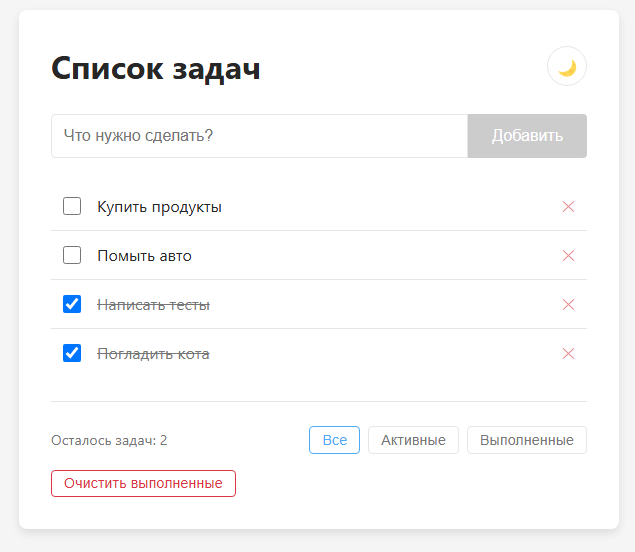
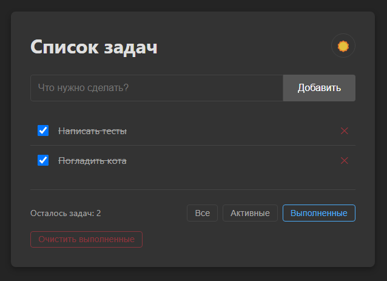

# Todo приложение

[](https://reactjs.org/)
[](https://www.typescriptlang.org/)
[](https://vitejs.dev/)
[](https://jestjs.io/)

Простое, но функциональное Todo приложение, разработанное с использованием React, TypeScript и Vite. Приложение имеет чистую архитектуру, следуя модульному подходу, и включает поддержку светлой и темной темы.

https://todudo.netlify.app/




## Особенности

- 📝 Создание, удаление и отметка задач как выполненных
- 🔍 Фильтрация задач (все, активные, выполненные)
- 🧹 Очистка всех выполненных задач одной кнопкой
- 🌙 Поддержка светлой и темной темы, сохраняющаяся между сессиями
- 📱 Адаптивный дизайн для мобильных и десктопных устройств
- 💾 Автоматическое сохранение всех задач в локальное хранилище
- ⚡ Быстрая и отзывчивая работа благодаря использованию Vite
- 🧪 Полное покрытие тестами с использованием Jest и Testing Library

## Архитектура проекта

Проект организован по принципам Feature-Sliced Design:

```
src/
├── app/              # Инициализация приложения
├── entities/         # Бизнес-сущности
│   └── todo/
├── features/         # Пользовательские фичи
│   ├── todo-add/     # Добавление задачи
│   ├── todo-filter/  # Фильтрация задач
│   └── todo-list/    # Список задач
├── shared/           # Переиспользуемый код
│   ├── lib/
│   │   └── hooks/    # Кастомные хуки
│   ├── types/        # TypeScript типы
│   └── ui/           # UI компоненты
└── widgets/          # Композиционные блоки
    └── todo/
```

## Технологический стек

- **React 18** - библиотека для создания пользовательских интерфейсов
- **TypeScript** - типизация и улучшение разработки
- **Vite** - быстрый инструмент сборки и разработки
- **CSS Modules** - изолированные стили для компонентов
- **Jest & Testing Library** - тестирование компонентов и хуков
- **ESLint** - статический анализ кода

## Начало работы

### Предварительные требования

- Node.js 18.x или выше
- npm 7.x или выше

### Установка

1. Клонировать репозиторий:

```bash
git clone https://github.com/username/todo-app.git
cd todo-app
```

2. Установить зависимости:

```bash
npm install
```

### Запуск для разработки

```bash
npm run dev
```

Откройте [http://localhost:5173](http://localhost:5173) в браузере чтобы увидеть приложение.

### Запуск тестов

```bash
npm test
```

### Сборка для продакшена

```bash
npm run build
```

Собранное приложение будет находиться в директории `dist`.

## Использование

### Добавление задачи

1. Введите текст задачи в поле ввода
2. Нажмите кнопку "Добавить" или клавишу Enter

### Управление задачами

- Отметьте чекбокс, чтобы пометить задачу как выполненную
- Нажмите на "✕" чтобы удалить задачу
- Используйте фильтры "Все", "Активные" или "Выполненные" для отображения нужных задач
- Нажмите "Очистить выполненные" чтобы удалить все завершенные задачи

### Переключение темы

- Нажмите на иконку 🌙/☀️ в правом верхнем углу для переключения между темной и светлой темой

